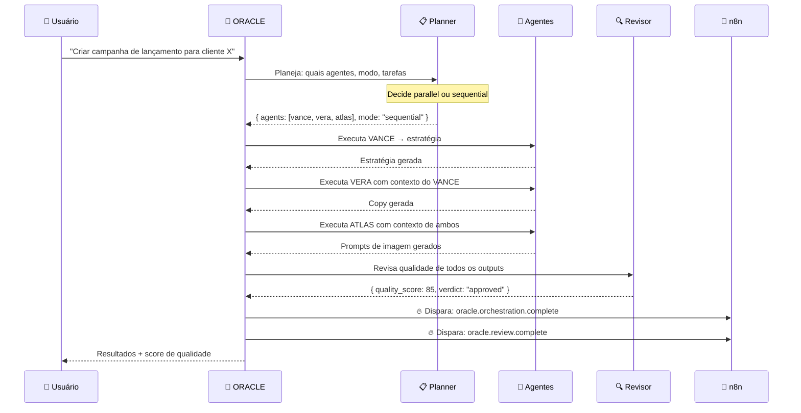

# 🧠 Agency OS — Documentação do Sistema

> Sistema autônomo de agentes de IA para agências de marketing digital.
> Stack: Next.js 16 · Supabase · OpenRouter · n8n · Vercel

---

## 📐 Arquitetura Geral

```mermaid
graph TB
    subgraph "🖥️ Frontend (Next.js)"
        UI[Interface do Usuário]
        CS[Creative Studio]
        OC[Oracle Chat]
    end

    subgraph "⚡ API Routes (Vercel Edge)"
        CHAT[/oracle/chat]
        ORCH[/oracle/orchestrate]
        RUN[/agents/run]
        ATL[/atlas/generate-carousel]
        APR[/atlas/approve]
    end

    subgraph "🤖 ORACLE — Maestro"
        PLAN[Planner DNA]
        EXEC[Executor]
        REV[Revisor de Qualidade]
    end

    subgraph "🧬 22 Agentes"
        L1[Camada Estratégica]
        L2[Camada de Produção]
        L3[Camada Operacional]
    end

    subgraph "🔌 Pipeline n8n"
        WH[Webhook Master]
        RT[Roteador de Eventos]
        DB2[Salvar no Supabase]
    end

    subgraph "🗃️ Supabase"
        JO[job_outputs]
        CA[creative_assets]
        PE[pipeline_events]
        AC[agent_conversations]
    end

    UI --> CHAT
    CS --> ATL
    CS --> APR
    OC --> ORCH

    CHAT --> L2
    ORCH --> PLAN
    PLAN --> EXEC
    EXEC --> L1 & L2 & L3
    L1 & L2 & L3 --> REV
    REV --> JO

    ATL --> CA
    APR --> CA

    EXEC --> WH
    REV --> WH
    APR --> WH

    WH --> RT --> DB2
    DB2 --> PE
```

---

## 🤖 Os 22 Agentes

### 🎯 Camada Estratégica — Visão & Planejamento

| Agente | Nome | Especialidade | Modelo |
|--------|------|---------------|--------|
| `oracle` | **ORACLE** | Maestro — orquestra todos os agentes | claude-sonnet-4-5 |
| `vance` | **VANCE** | Estratégia de marca e marketing | qwen3-235b |
| `iris` | **IRIS** | Pesquisa e inteligência de mercado | gpt-4o-mini |
| `prism` | **PRISM** | Cultura digital e análise de audiência | qwen3-235b |
| `surge` | **SURGE** | Growth hacking e experimentos | qwen3-235b |
| `genesis` | **GENESIS** | Design e configuração de agentes | claude-sonnet-4-5 |
| `lore` | **LORE** | Memória institucional da agência | claude-sonnet-4-5 |

### 🎨 Camada de Produção — Criar & Executar

| Agente | Nome | Especialidade | Modelo |
|--------|------|---------------|--------|
| `vera` | **VERA** | Copywriting e textos persuasivos | qwen3-235b |
| `marco` | **MARCO** | Roteiros para vídeo e Reels | qwen3-235b |
| `atlas` | **ATLAS** | Direção de arte e prompts de imagem | gpt-4o-mini |
| `volt` | **VOLT** | Tráfego pago — Meta Ads e Google Ads | qwen3-235b |
| `pulse` | **PULSE** | Social media e engajamento | qwen3-235b |
| `cipher` | **CIPHER** | Distribuição e publicação de conteúdo | qwen3-235b |
| `flux` | **FLUX** | Automações — n8n, Zapier, Make | qwen3-235b |
| `vox` | **VOX** | Áudio, narração e podcasts | qwen3-235b |
| `vector` | **VECTOR** | Analytics e performance de dados | gpt-4o-mini |

### ⚙️ Camada Operacional — Processos & Relacionamento

| Agente | Nome | Especialidade | Modelo |
|--------|------|---------------|--------|
| `nexus` | **NEXUS** | Relacionamento com clientes | qwen3-235b |
| `bridge` | **BRIDGE** | Onboarding de novos clientes | qwen3-235b |
| `aegis` | **AEGIS** | Controle de qualidade e aprovações | gpt-4o-mini |
| `harbor` | **HARBOR** | CRM e pipeline comercial | qwen3-235b |
| `ledger` | **LEDGER** | Finanças — ROI, MRR, propostas | gpt-4o-mini |
| `anchor` | **ANCHOR** | Customer success e retenção | qwen3-235b |

---

## 🔄 Como o ORACLE Orquestra



### Modos de Execução

| Modo | Quando usar | Como funciona |
|------|-------------|---------------|
| `parallel` | Tarefas independentes | Todos os agentes rodam simultaneamente |
| `sequential` | Tarefas encadeadas | Cada agente recebe o output do anterior como contexto |

### Score de Qualidade

| Score | Verdict | Ação |
|-------|---------|------|
| ≥ 70 | `approved` | Entrega final |
| < 70 | `needs_revision` | Oracle re-executa os agentes flagrados (1x) |

---

## 🔌 Pipeline n8n — Eventos

### Configuração

Adicione estas variáveis de ambiente no Vercel + `.env.local`:

```bash
# Pipeline Master (um único webhook para todos os eventos)
N8N_WEBHOOK_ORCHESTRATION_COMPLETE=https://seu-n8n.com/webhook/agency-os-pipeline
N8N_WEBHOOK_REVIEW_COMPLETE=https://seu-n8n.com/webhook/agency-os-pipeline
N8N_WEBHOOK_CHAT_ROUTED=https://seu-n8n.com/webhook/agency-os-pipeline
N8N_WEBHOOK_CAROUSEL_GENERATED=https://seu-n8n.com/webhook/agency-os-pipeline
N8N_WEBHOOK_CAROUSEL_APPROVED=https://seu-n8n.com/webhook/agency-os-pipeline
N8N_WEBHOOK_AGENT_TASK=https://seu-n8n.com/webhook/agency-os-pipeline
```

> **Dica**: Use o mesmo webhook para todos os eventos — o n8n roteia pelo campo `event`.
> Ou configure URLs separadas para cada evento se preferir workflows independentes.

### Tabela de Eventos

| Evento | Disparado quando | Campos principais no payload |
|--------|-----------------|------------------------------|
| `oracle.orchestration.complete` | Oracle termina orquestração completa | `campaign_title`, `mode`, `agents_used[]`, `review`, `client_id` |
| `oracle.review.complete` | Oracle conclui revisão de qualidade | `campaign_title`, `quality_score`, `verdict`, `summary`, `agents_revised[]` |
| `oracle.chat.routed` | Oracle roteia mensagem para agente no chat | `agent`, `agent_label`, `message_preview`, `client_id` |
| `atlas.carousel.generated` | Carrossel de imagens gerado | `asset_id`, `client_id`, `format`, `template`, `slide_count` |
| `atlas.carousel.approved` | Carrossel aprovado pelo usuário | `asset_id`, `client_id`, `action: "approved"`, `approved_by` |
| `atlas.carousel.rejected` | Carrossel rejeitado pelo usuário | `asset_id`, `client_id`, `action: "rejected"`, `approved_by` |
| `agent.task.complete` | Qualquer agente conclui uma tarefa | `agent`, `label`, `task`, `chars`, `client_id` |
| `agent.task.failed` | Qualquer agente falha em uma tarefa | `agent`, `label`, `task`, `client_id` |

### Estrutura do Payload (todos os eventos)

```json
{
  "event":     "oracle.orchestration.complete",
  "source":    "agency-os",
  "timestamp": "2025-01-15T14:30:00.000Z",
  "campaign_title": "Campanha de Lançamento Produto X",
  "mode":      "sequential",
  "client_id": "uuid-do-cliente",
  "workspace_id": "uuid-do-workspace",
  "agents_used": [
    { "agent": "vance", "label": "VANCE", "status": "fulfilled", "chars": 1240 },
    { "agent": "vera",  "label": "VERA",  "status": "fulfilled", "chars": 890 }
  ],
  "review": {
    "quality_score": 85,
    "verdict": "approved",
    "summary": "Outputs de alta qualidade e alinhados ao briefing."
  }
}
```

### Workflow Master (importar no n8n)

O arquivo `supabase/n8n-workflow-master-pipeline.json` contém um workflow completo com:
- Webhook recebe todos os eventos
- Switch roteia por tipo de evento
- Salva no Supabase em tabela `pipeline_events`

**Para importar**: n8n → Workflows → Import → selecionar o arquivo JSON.

### Tabela Supabase para Eventos

```sql
-- Execute no Supabase SQL Editor
CREATE TABLE IF NOT EXISTS pipeline_events (
  id           UUID DEFAULT gen_random_uuid() PRIMARY KEY,
  event        TEXT NOT NULL,
  source       TEXT DEFAULT 'agency-os',
  agent        TEXT,
  label        TEXT,
  asset_id     UUID,
  campaign_title TEXT,
  quality_score  INTEGER,
  verdict      TEXT,
  summary      TEXT,
  mode         TEXT,
  agents_count INTEGER,
  client_id    UUID,
  workspace_id UUID,
  approved_by  UUID,
  format       TEXT,
  template     TEXT,
  payload      JSONB,
  created_at   TIMESTAMPTZ DEFAULT NOW()
);

-- RLS
ALTER TABLE pipeline_events ENABLE ROW LEVEL SECURITY;
CREATE POLICY "workspace members can read own events"
  ON pipeline_events FOR SELECT
  USING (workspace_id IN (
    SELECT workspace_id FROM profiles WHERE id = auth.uid()
  ));
```

---

## 📡 API Endpoints

### Oracle

| Método | Rota | Descrição | Auth |
|--------|------|-----------|------|
| `POST` | `/api/agents/oracle/chat` | Chat direto com Oracle (streaming) | ✅ Requer login |
| `POST` | `/api/agents/oracle/orchestrate` | Orquestração completa de múltiplos agentes | ✅ Requer login |

**Payload `/orchestrate`:**
```json
{
  "message":   "Crie uma campanha completa para lançamento de produto X",
  "client_id": "uuid-opcional",
  "job_id":    "uuid-opcional"
}
```

**Resposta `/orchestrate`:**
```json
{
  "campaign_title": "Campanha Produto X",
  "mode": "sequential",
  "agents": [
    {
      "agent":     "vance",
      "label":     "VANCE",
      "task":      "Desenvolver estratégia de marca",
      "content":   "...",
      "output_id": "uuid-salvo-no-supabase",
      "status":    "fulfilled"
    }
  ],
  "review": {
    "quality_score": 85,
    "verdict":       "approved",
    "summary":       "Outputs de alta qualidade."
  }
}
```

### ATLAS

| Método | Rota | Descrição | Auth |
|--------|------|-----------|------|
| `POST` | `/api/agents/atlas/generate-carousel` | Gera carrossel com copy + imagens | ✅ Requer login |
| `POST` | `/api/agents/atlas/approve` | Aprova ou rejeita carrossel | ✅ Requer login |

**Payload `/generate-carousel`:**
```json
{
  "prompt":     "Carrossel para lançamento de skincare natural",
  "client_id":  "uuid-do-cliente",
  "format":     "square",
  "template":   "minimal",
  "slide_count": 5,
  "aspect_ratio": "1:1"
}
```

**Payload `/approve`:**
```json
{
  "assetId": "uuid-do-asset",
  "action":  "approved"
}
```

### Agentes

| Método | Rota | Descrição | Auth |
|--------|------|-----------|------|
| `POST` | `/api/agents/run` | Executa agente individual com arquivo de prompt | ✅ Requer login |

**Payload `/run`:**
```json
{
  "agent_id":  "vera",
  "input":     "Criar copy para Instagram post sobre produto X",
  "client_id": "uuid-opcional",
  "job_id":    "uuid-opcional"
}
```

---

## 🗃️ Banco de Dados — Supabase

| Tabela | Finalidade | Campos Chave |
|--------|-----------|-------------|
| `job_outputs` | Outputs de todos os agentes | `agent_id`, `output_content`, `output_type`, `status` |
| `creative_assets` | Carrosseis e imagens geradas | `format`, `template`, `slide_count`, `image_url`, `status` |
| `agent_conversations` | Histórico de chats com Oracle | `agent_id`, `messages[]`, `user_id` |
| `pipeline_events` | Todos os eventos do pipeline n8n | `event`, `payload`, `client_id`, `created_at` |
| `profiles` | Usuários com workspace e plano | `workspace_id`, `plan`, `credits` |
| `workspaces` | Workspaces de agência | `name`, `credit_balance`, `plan` |
| `clients` | Clientes da agência | `name`, `instagram_handle`, `niche` |

### Status de Outputs (`job_outputs`)

```
pending   → Agente executou, aguardando revisão
approved  → Aprovado pelo usuário ou Oracle
rejected  → Rejeitado para revisão
```

---

## 🔑 Variáveis de Ambiente

```bash
# ── Obrigatórias ──────────────────────────────────────────────
OPENROUTER_API_KEY=sk-or-...
NEXT_PUBLIC_SUPABASE_URL=https://xxx.supabase.co
NEXT_PUBLIC_SUPABASE_ANON_KEY=eyJ...
SUPABASE_SERVICE_ROLE_KEY=eyJ...

# ── Agentes Especializados ────────────────────────────────────
ELEVENLABS_API_KEY=...     # VOX — geração de áudio
APIFY_API_TOKEN=...        # IRIS/PULSE — métricas de Instagram
RESEND_API_KEY=...         # NEXUS — envio de emails

# ── Pipeline n8n ──────────────────────────────────────────────
# Use o mesmo URL para todos os eventos (webhook master)
# ou URLs separados para workflows independentes
N8N_WEBHOOK_ORCHESTRATION_COMPLETE=https://n8n.seudominio.com/webhook/agency-os-pipeline
N8N_WEBHOOK_REVIEW_COMPLETE=https://n8n.seudominio.com/webhook/agency-os-pipeline
N8N_WEBHOOK_CHAT_ROUTED=https://n8n.seudominio.com/webhook/agency-os-pipeline
N8N_WEBHOOK_CAROUSEL_GENERATED=https://n8n.seudominio.com/webhook/agency-os-pipeline
N8N_WEBHOOK_CAROUSEL_APPROVED=https://n8n.seudominio.com/webhook/agency-os-pipeline
N8N_WEBHOOK_AGENT_TASK=https://n8n.seudominio.com/webhook/agency-os-pipeline

# ── Legado (retrocompatível) ──────────────────────────────────
N8N_WEBHOOK_CAROUSEL_APPROVED=...  # Webhook anterior — mantido por compatibilidade
```

---

## 🚀 Guia Rápido

### 1. Configurar o Pipeline n8n

```bash
# 1. Importe o workflow master no seu n8n
#    → Arquivo: supabase/n8n-workflow-master-pipeline.json

# 2. No n8n, ative o workflow e copie a URL do webhook:
#    → Ex: https://n8n.seudominio.com/webhook/agency-os-pipeline

# 3. Configure as env vars no Vercel:
vercel env add N8N_WEBHOOK_ORCHESTRATION_COMPLETE
# (cole a URL do webhook e repita para cada variável)

# 4. Crie a tabela no Supabase:
#    → SQL Editor → cole o CREATE TABLE da seção Pipeline n8n
```

### 2. Testar o Pipeline

```bash
# Teste local — rode a orquestração e verifique o n8n
curl -X POST http://localhost:3000/api/agents/oracle/orchestrate \
  -H "Content-Type: application/json" \
  -H "Cookie: sb-xxx=..." \
  -d '{"message": "Criar campanha para lançamento de produto"}'

# Se N8N_WEBHOOK_* estiver configurado, o n8n receberá:
# → oracle.orchestration.complete
# → oracle.review.complete
```

### 3. Fluxo Completo de Campanha

```
1. Usuário descreve campanha → ORACLE
2. ORACLE planeja → seleciona 3-5 agentes + modo
3. Agentes executam → outputs salvos no Supabase (job_outputs)
4. ORACLE revisa → quality_score + feedback
5. n8n recebe evento → salva em pipeline_events
6. ATLAS gera carrossel → imagens + copy (creative_assets)
7. Usuário aprova → n8n recebe atlas.carousel.approved
8. Entrega ao cliente
```

---

## 📁 Estrutura de Arquivos Chave

```
agency-os/web/
├── app/
│   └── api/
│       └── agents/
│           ├── oracle/
│           │   ├── chat/route.ts          # Chat streaming com Oracle
│           │   └── orchestrate/route.ts   # Orquestração autônoma (21 agentes)
│           ├── atlas/
│           │   ├── generate-carousel/     # Geração de carrossel
│           │   └── approve/route.ts       # Aprovação + n8n
│           └── run/route.ts               # Execução individual de agente
├── lib/
│   ├── n8n-pipeline.ts                    # ⭐ Pipeline centralizado (fire-and-forget)
│   ├── openrouter/
│   │   ├── IntelligenceRouter.ts          # ATLAS — modelos e tamanhos de imagem
│   │   └── models.ts                      # Mapa de modelos por agente
│   ├── anthropic/
│   │   └── agents-config.ts               # Configuração dos 22 agentes
│   └── apify/tools.ts                     # Métricas de Instagram (IRIS/PULSE)
├── supabase/
│   ├── n8n-workflow-master-pipeline.json  # ⭐ Workflow n8n — importar
│   └── n8n-workflow-carousel-approved.json # Workflow legado
└── types/
    └── agents.ts                          # AgentType + AGENT_LABELS
```

---

*Documentação gerada em 2025 · Agency OS v2.0 · 22 agentes autônomos*
